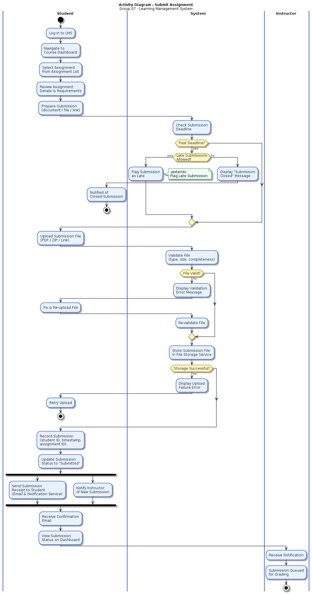
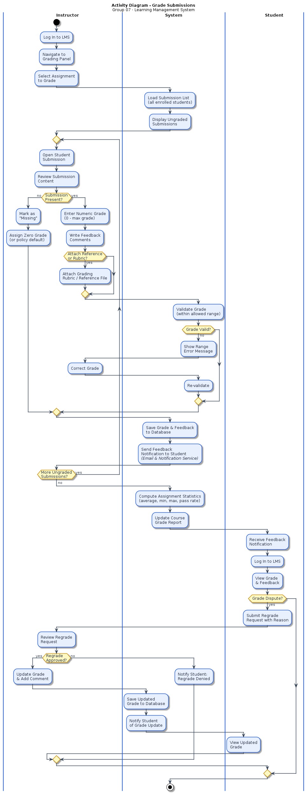
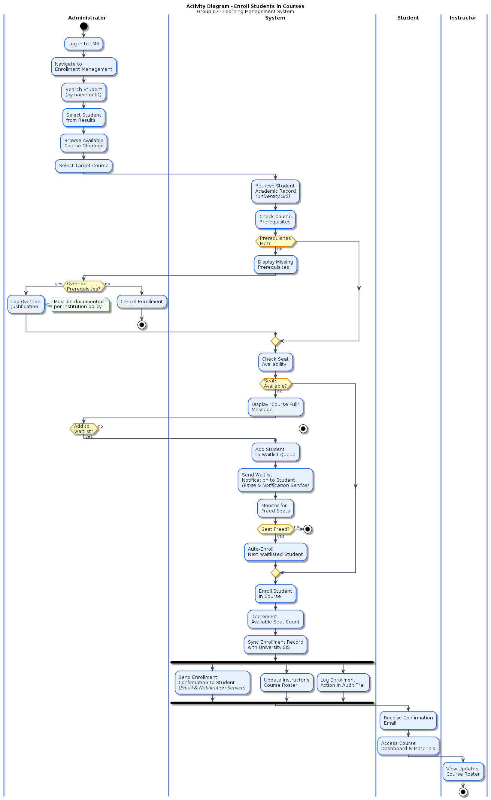
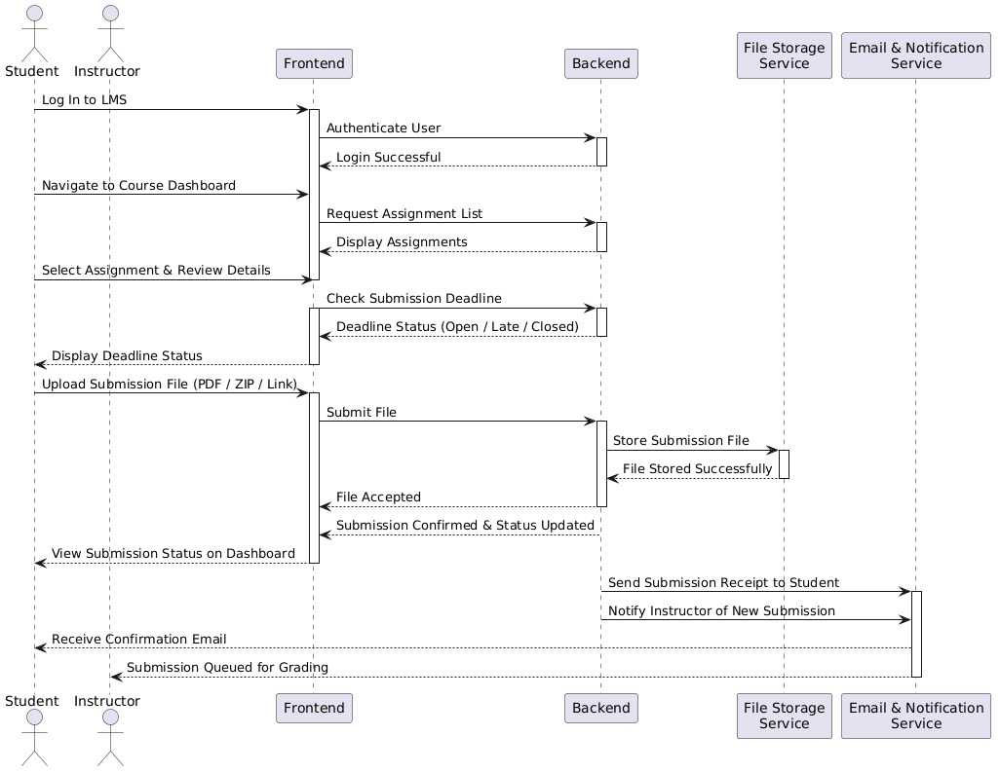
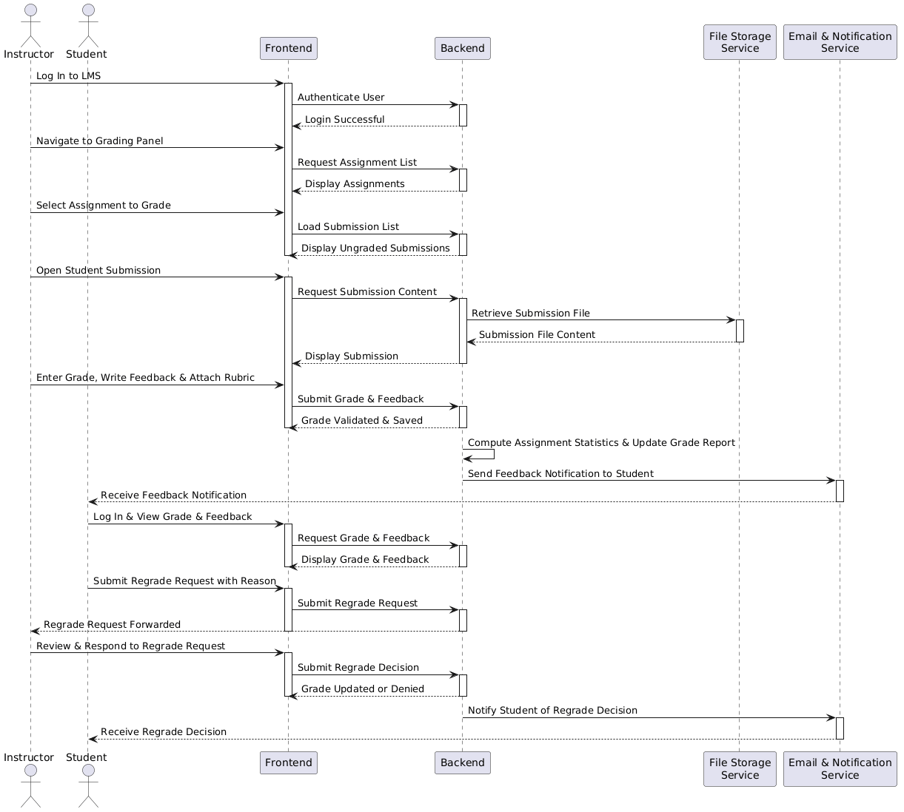
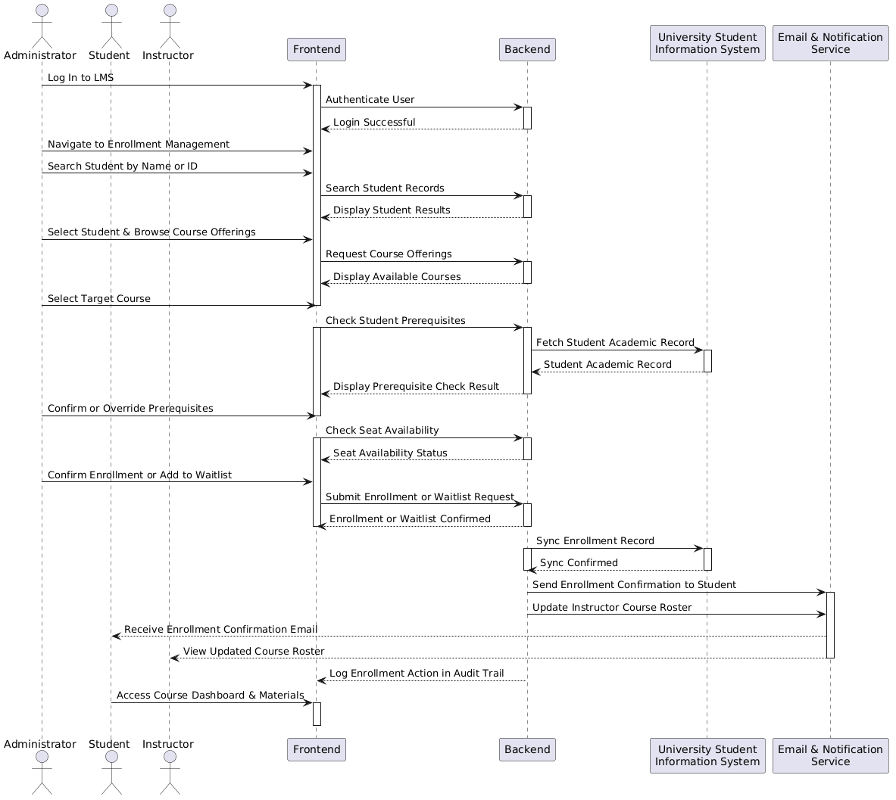
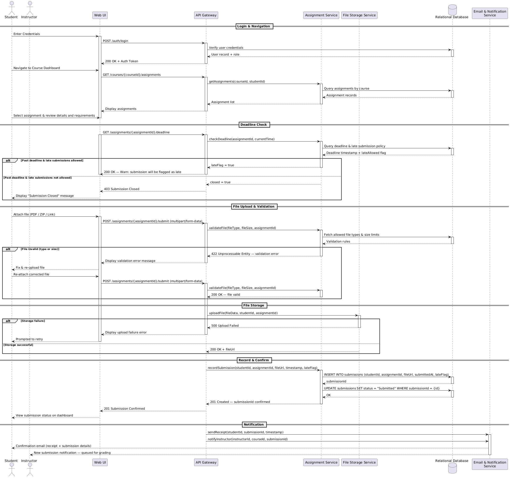
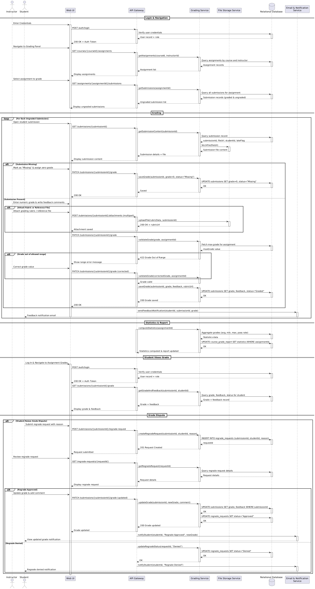
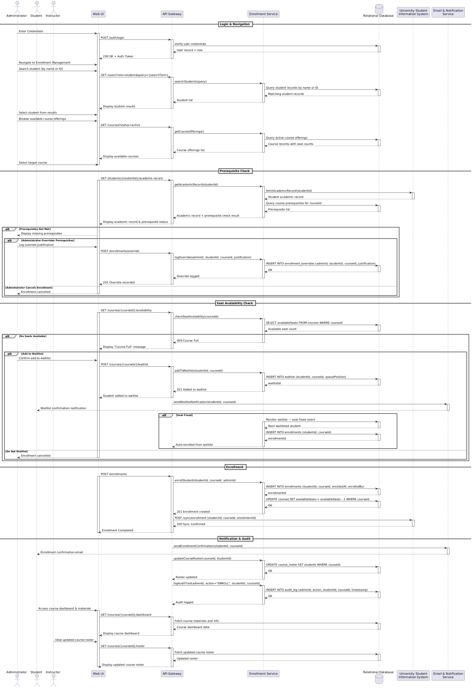

<!--
  se_report_group_07.md
  Software Engineering — CS13477 — Spring 2026
  Group 07 — Learning Management System
  NOTE: The README below is embedded verbatim as the first page (title page),
        per project instructions: "README.md shall be included in the report
        as the Title Page. This is mandatory."
-->

# Learning Management System — Group 07

## 1. Group Info

- **Group Number:** 07
- **Case Study:** Group 07 — Learning Management System (LMS)
- **Course:** Software Engineering — CS13477 — Spring 2026
- **Instructor:** *Dr. Samer Elkababji*

| # | Name | Student ID |
| :---: | :--- | :--- |
| 1 | *Mohammad Tabba'a* | *20220005* |
| 2 | *Tala Hammouri* | *20210061* |
| 3 | *Lojain Hamdan* | *20210576* |
| 4 | *Jude Mamoon* | *20210415* |

---

## 2. Overview

### System Purpose

The Learning Management System (LMS) is a web-based platform that supports online teaching, learning, and academic management. It enables instructors to deliver course content, create assessments, grade submissions, and distribute feedback, while students access course resources, submit assignments, and track their academic performance. Administrators manage user accounts, course offerings, and platform operations. The system is integrated with an external Authentication System, a University Student Information System (SIS), and an Email & Notification Service to support a complete academic workflow.

### Tools Used

- **Visual Studio Code (VS Code)** — primary IDE for editing diagrams, Markdown, and report files.
- **PlantUML** — text-based UML modelling for all diagrams; sources kept under `/uml/`.
- **C4-PlantUML library** — used for C4 Level 1 (Context) and C4 Level 2 (Container) diagrams.
- **Pandoc** — conversion of the Markdown report into the final PDF deliverable.
- **Git & GitHub** — version control, per-member commits, tagged releases (`v1.0.0`, `v2.0.0`).

---

## 3. Diagrams

All diagram sources are stored as `.puml` files under `/uml/` and exported to `.png` for embedding in the report.

### Part I — Context

- **C4 Level 1 — System Context Diagram** (`lms_c4_l1.puml`): shows the LMS as a single black box and its three human actors (Student, Instructor, Administrator) together with the three external systems it integrates with (Authentication System, University SIS, Email & Notification Service).
- **C4 Level 2 — Container Diagram** (`c4_l2_container_lms.puml`): decomposes the LMS into its internal containers — Web Application (React SPA), Backend API Server (Python/Django), Relational Database (PostgreSQL), and File Storage Service (Object Storage) — and their protocols.
- **Activity Diagrams with Swimlanes** — one per key scenario:
  - `act_submit_assignment.puml` — Student submission flow including deadline and validation branches.
  - `act_grade_submissions.puml` — Instructor grading loop with regrade-request sub-flow.
  - `act_enroll_students.puml` — Administrator enrollment with prerequisite check, seat availability, and waitlisting.

### Part II — Interactions

- **Composite Use Case Diagrams** (one per actor):
  - `student_usecase.puml`
  - `instructor_usecase.puml`
  - `administrator_usecase.puml`
- **Individual Use Case Diagrams** (with `<<include>>` / `<<extend>>`):
  - Student: `student_submit_assignment.puml`, `student_access_course_materials.puml`, `student_view_performance_report.puml`
  - Instructor: `instructor_upload_lecture_material.puml`, `instructor_grade_submission.puml`, `instructor_create_assessment.puml`
  - Administrator: `admin_enroll_student.puml`, `admin_assign_instructor.puml`, `admin_generate_report.puml`
- **Use Case Descriptions** (tabular): provided in the report for each individual use case.
- **Sequence Diagrams — High-Level (stakeholder view):**
  - `lms_seq_hl_submit_assignment.puml`
  - `lms_seq_hl_grade_submissions.puml`
  - `lms_seq_hl_enroll_students.puml`
- **Sequence Diagrams — Detailed (developer view):**
  - `lms_seq_dev_submit_assignment.puml`
  - `lms_seq_dev_grade_submissions.puml`
  - `lms_seq_dev_enroll_students.puml`

---

## 4. Repo Structure

```
.
├── README.md              # This file — title page of the report
├── docs/
│   ├── se_report_group_07.md    # Full Markdown report (source)
│   └── se_report_group_07.pdf   # Final PDF report (Pandoc output)
└── uml/
    ├── *.puml             # PlantUML source for every diagram
    └── *.png              # Rendered images embedded in the report
```

- **`/README.md`** — the team’s title page; embedded as the first page of the report.
- **`/docs/`** — the report in Markdown source form and the final PDF deliverable.
- **`/uml/`** — all PlantUML sources and their rendered PNG exports; the report references these PNGs via relative paths (`../uml/*.png`).

---

## 5. Contributions

### Member Roles

| Member | Role |
| :--- | :--- |
| *Mohammad Tabba'a* | *Activity diagrams & report editing* |
| *Tala Hammouri* | *Use case diagrams & descriptions* |
| *Lojain Hamdan* | *Sequence diagrams (HL & developer)* |
| *Jude Mamoon* | *C4 L1(Context) & L2(Container) modelling* |

### Commits per Team Member

| Member | Number of Commits |
| :--- | :---: |
| *Mohammad Tabba'a* | *8* |
| *Tala Hammouri* | *8* |
| *Lojain Hamdan* | *8* |
| *Jude Mamoon* | *8* |
---

# 1. System Description

## 1.1 Domain and Purpose

The Learning Management System (LMS) modelled in this project is a web-based platform that supports the full lifecycle of online teaching and learning within a higher-education institution. It is the central workspace where instructors publish course materials and assessments, students submit work and retrieve feedback, and administrators manage enrollments, teaching assignments, and platform-wide reports. The system is assumed to be operated by a single university and to serve its registered members only — access to every feature is mediated by authenticated user accounts with role-based authorization (Student, Instructor, Administrator).

## 1.2 Scope and Boundary

The LMS does **not** own identity, academic records, or message delivery — each of these concerns is delegated to an external system:

- **Authentication System** (university SSO / LDAP) — the single source of truth for user identity and credentials.
- **University Student Information System (SIS)** — the system of record for enrollment data, academic history, and final grade transfers; the LMS synchronizes with it rather than replicating it.
- **Email & Notification Service** — the outbound channel used to send deadline reminders, grade-release notifications, and enrollment confirmations.

Inside its own boundary, the LMS is responsible for: course-material hosting, assessment authoring and configuration, submission lifecycle (upload, late-flagging, storage), grading workflow, feedback release, performance reporting for students, and platform reporting for administrators. The C4 Level 2 container diagram decomposes this into a React Single-Page Application (the user interface), a Django-based Backend API Server (all business logic), a PostgreSQL relational database (users, courses, assignments, grades), and an object storage service (lecture files and submissions). Asynchronous work such as notification dispatch is an internal concern of the Backend API and therefore not elevated to an L2 container.

## 1.3 Stakeholders and Key Flows

Three primary human actors drive the system:

- **Student** — browses enrolled courses, downloads materials, submits assignments (with optional late-flag extension), and views per-course performance reports.
- **Instructor** — uploads lecture materials, creates assessments with configurable deadlines and attempt policies, and grades submissions with written and optional inline feedback.
- **Administrator** — enrolls students individually or in batches from the SIS, assigns instructors to course offerings, and generates platform-level reports.

Three end-to-end scenarios are modelled in depth across activity and sequence diagrams because they exercise the system's core capabilities and touch every container: **Submit Assignment**, **Grade Submission**, and **Enroll Student in Course**.

## 1.4 Modelling Approach

The project follows the workflow prescribed in the project instructions. **Part I (Context)** establishes the system boundary and data-flow structure via C4 Levels 1 and 2 and three swimlane activity diagrams. **Part II (Interactions)** captures functional requirements through composite and individual use case diagrams, tabular use case descriptions (SD06a slide 21 format), and both stakeholder-level and developer-level sequence diagrams for the three core scenarios. Parts III (Structure — class diagram) and IV (Behavior — DFD / state) are planned for the final tagged version (`v2.0.0`) and will build on the vocabulary fixed by the artifacts in this report.
---

# 2. Part I — Context

All diagrams in this section are rendered from the corresponding `.puml` sources in `/uml/` and embedded as PNGs. Each subsection presents the diagram followed by its explanation.

## 2.1 C4 Level 1 — System Context Diagram


This is the highest-level view of the LMS. The system itself appears as a single box; everything outside that box is either a human user or an external system the LMS depends on.

- **Human actors.** The *Student*, *Instructor*, and *Administrator* are the three user roles the system must serve. Each has a distinct, non-overlapping set of interactions, summarized by the verb phrase on their relationship to the LMS (e.g., the Student "accesses course resources, submits assignments, and views performance reports" while the Instructor "uploads lecture materials, creates assessments, and manages grades").
- **External systems.** Three systems sit outside the boundary and are deliberately kept out of scope for implementation: the *Authentication System* (identity verification via SSO/LDAP), the *University Student Information System* (enrollment records, academic history, grade transfers), and the *Email & Notification Service* (outbound deadline reminders and feedback notifications).
- **Directionality.** Users interact with the LMS; the LMS in turn calls out to the three external systems. This one-way outbound pattern from LMS to externals is preserved at Level 2 and in the sequence diagrams.

The point of this diagram is to fix the system boundary before any structural detail is introduced: it answers "who uses the LMS, and what does it depend on?" in a single picture.

## 2.2 C4 Level 2 — Container Diagram


This diagram opens the LMS box from Level 1 and shows the separately runnable/deployable units that realize it. Four containers are inside the boundary:

- **Web Application** (React.js SPA) — runs in the user's browser. Every interaction starts here; it hosts the UI for browsing courses, submitting assignments, grading, and administration.
- **Backend API Server** (Python / Django) — the single hub where all business logic lives: authentication orchestration, course operations, assignment lifecycle, grading, and notification dispatch. Choosing Django reflects the de-facto LMS backend stack (edX, Open edX).
- **Relational Database** (PostgreSQL) — the centralized store for users, courses, assignments, submissions, grades, and audit logs. Every structured domain record lives here.
- **File Storage Service** (Object Storage / AWS S3) — binary content (lecture slides, PDFs, videos, submission files) is kept out of the relational database and served from object storage. This mirrors Simon Brown's *Statement Store* pattern from the Internet Banking reference.

Protocols are annotated on every edge: users talk to the SPA over **HTTPS**; the SPA calls the API over **HTTPS / JSON**; the API persists via **SQL** and **S3 API**; and the API reaches external systems via **HTTPS / SMTP** (email), **HTTPS / LDAP** (auth), and **HTTPS / JSON** (SIS). Verb phrases on external-facing edges are preserved from Level 1 so the two levels can be read together without contradiction.

Design decisions to note:

1. **Static-asset delivery (CDN / Nginx)** is treated as a Level 3 / deployment concern and not elevated to an L2 container.
2. **Asynchronous notification** (broker, worker process) is a Level 3 component-level concern of the Backend API; at L2 we expose only the architectural capability — the system sends notifications to an external email service.

## 2.3 Activity Diagram (Swimlanes) — Submit Assignment



Three swimlanes — *Student*, *System*, *Instructor* — partition the flow by responsibility. The student authenticates, navigates to the assignment, and prepares a file. Control crosses to the *System* lane for a deadline check: if the deadline has passed and late submissions are allowed, the flow enters the `«extend» Flag Late Submission` branch; if late submissions are **not** allowed, the flow terminates with a "Submission Closed" message. Otherwise, the system validates the uploaded file (type, size, completeness) and, if invalid, returns control to the student to fix and re-upload. Once stored, the system records the submission with a timestamp and then **forks** into two parallel actions: sending a receipt to the student and notifying the instructor. Both branches join before the flow stops.

The diagram covers the three decision points that distinguish a submission from simply uploading a file: **deadline**, **file validity**, and **storage success**, plus the parallel notification fan-out to two actors.

## 2.4 Activity Diagram (Swimlanes) — Grade Submissions



This diagram models the instructor's full grading loop plus the student's downstream reaction path. The instructor logs in, opens the grading panel, and enters a `repeat` block over each ungraded submission. Inside the loop, a *submission present?* decision routes missing work to a policy-default zero grade, while present work goes through the grade + feedback entry path with an optional `Attach Grading Rubric / Reference File` branch. The system validates that the grade is in range; out-of-range values loop back to the instructor for correction. After the loop terminates, the system computes per-assignment statistics (average, min, max, pass rate) and updates the course grade report.

The flow then crosses into the *Student* lane, where the student receives the feedback notification and views the grade. A **regrade dispute** branch models the escalation path: the student can file a regrade request, the instructor reviews it, and the system either updates the grade and notifies the student, or notifies them that the regrade was denied. Swimlanes make the handover between instructor, system, and student explicit, which matters here because grading is an inherently multi-actor interaction.

## 2.5 Activity Diagram (Swimlanes) — Enroll Students in Courses



The administrator's enrollment flow is the most decision-rich of the three because it must respect institutional policy. After login and student selection, control passes to the *System* lane to retrieve the student's academic record from the University SIS and check prerequisites. A failed prerequisite check forks: the administrator may either **override** (with a mandatory justification logged per institution policy) or **cancel** the enrollment. Next, the system checks seat availability. If the course is full, the administrator may add the student to a **waitlist**; the system then monitors for freed seats and auto-enrolls the next waitlisted student when one appears.

On successful enrollment, the system performs three parallel actions in a `fork`: sending an enrollment confirmation email, updating the instructor's course roster, and logging the action in the audit trail. Control then crosses into both the *Student* and *Instructor* lanes — the student receives the confirmation and can access the course dashboard, and the instructor sees the updated roster. The diagram's branching captures all three real-world exception paths (missing prerequisites, full course with waitlist, override with justification) that a plain "happy path" flow would hide.
---

# 3. Part II — Interactions

## 3.1 Use Case Diagrams

### 3.1.1 Composite Use Case Diagram — Student


This is the top-level catalogue of every capability the LMS exposes to a Student. Ten use cases are listed: viewing enrolled courses, accessing course materials, viewing assignment deadlines, submitting assignments, withdrawing a submission, viewing feedback and grades, viewing per-course performance, viewing overall academic performance, and receiving notifications. The diagram is intentionally flat — no `<<include>>` or `<<extend>>` relationships are shown here; decomposition is handled in the individual use case diagrams below. The point of this view is to give stakeholders a one-glance inventory of "everything a student can do" before drilling into any single flow.

### 3.1.2 Composite Use Case Diagram — Instructor


The instructor's catalogue mirrors the student's in structure but covers teaching capabilities: managing lecture materials, creating assessments, scheduling assessment visibility, grading submissions, providing feedback, managing course grades, viewing the course roster, monitoring student activity, tracking progress, and posting announcements. Ten use cases, no inheritance or inclusion — again, intentionally flat at this level.

### 3.1.3 Composite Use Case Diagram — Administrator


Seven platform-governance use cases are attributed to the Administrator: managing user accounts, enrolling students, assigning instructors, managing course offerings, configuring system settings, generating platform reports, and monitoring activity. The smaller use case count (vs. Student and Instructor) reflects the fact that the Administrator's role is operational rather than day-to-day content-centric.

### 3.1.4 Submit Assignment — Student


This diagram unpacks the single *Submit Assignment* use case. The Student actor is connected to the base use case, while two supporting actors — *File Storage Service* and *Email & Notification Service* — participate in included sub-steps. Four use cases are **always** invoked via `<<include>>`: *Log In*, *Select Assignment*, *Store Submission File*, and *Send Submission Receipt*. One use case extends the base conditionally: *Flag Late Submission* `<<extend>>`s *Submit Assignment* only when the submission arrives after the deadline and the instructor has allowed late submissions. The full scenario (data, stimulus, response, exceptions) is in the tabular description in section 3.2.1.

### 3.1.5 Access Course Materials — Student


The Student actor triggers *Access Course Materials*, which `<<include>>`s four sub-steps that always run: *Log In*, *Select Course*, *Retrieve Material File* (which involves the File Storage Service), and *Log Material View* (for instructor analytics). The *Download Material* use case `<<extend>>`s the base optionally — it executes only if the student chooses to save a local copy. Materials whose scheduled visibility is not yet open are filtered out at the retrieval step.

### 3.1.6 View Course Performance Report — Student


Four always-included sub-steps decompose the base: *Log In*, *Select Course*, *Aggregate Assignment Grades*, and *Calculate Course Grade* (applying the configured weights). A single extension, *Export Report as PDF*, is invoked optionally when the student requests an offline copy. Unreleased (draft) grades are excluded from the aggregation — a business rule captured in the use case description.

### 3.1.7 Upload Lecture Material — Instructor


The Instructor uploads a new material (slides, PDF, video, link). Four included sub-steps always run: *Log In*, *Select Course*, *Store Material File* (via File Storage Service), and *Notify Students of New Material* (via Email & Notification Service). The *Set Material Visibility* extension applies when the instructor schedules or hides the material; in that case notification dispatch is **deferred** until the visibility window opens. The Student actor appears on the diagram because students are the downstream recipients of the notification.

### 3.1.8 Grade Submission — Instructor


The instructor opens a student's submission, enters a grade and feedback, and releases it. Three `<<include>>`s: *Log In*, *View Submission*, and *Send Feedback Notification*. Note that *View Submission* is also directly accessible by the **Student** actor (who opens their own submission to read the feedback) — this is why both Student and Instructor appear on the diagram. *Add Inline Comment* `<<extend>>`s the base optionally — inline commentary is not required to release a grade.

### 3.1.9 Create Assessment — Instructor


Four included sub-steps: *Log In*, *Select Course*, *Configure Submission Settings* (deadline, window, attempts, late policy), and *Notify Students of New Assessment*. Two extensions model optional authoring choices: *Attach Reference File* (brief, rubric, dataset) and *Schedule Assessment Visibility* (assessment hidden until a future time; notification deferred). The Student actor is present as the downstream recipient of the notification.

### 3.1.10 Enroll Student in Course — Administrator


One included sub-step is always run: *Log In*. Two use cases `<<extend>>` the base: *Import Enrollment from SIS* (an alternative bulk entry path that invokes the external SIS) and *Create User Account* (triggered only when an imported student does not yet have an LMS account). The diagram shows four actors in total: the Administrator (primary), the Student (recipient of the enrollment notification), the University SIS (source system for bulk import), and the Email & Notification Service (for confirmation). Duplicate-enrollment prevention is a system rule, documented in the use case description.

### 3.1.11 Assign Instructor to Course — Administrator


Three included sub-steps always run: *Log In*, *Select Course Offering*, and *Select Instructor*. *Remove Previous Instructor* `<<extend>>`s the base only when the offering already has an instructor that must be replaced. A prerequisite handled **outside** this use case is that the selected user must already hold the instructor role — that is the responsibility of the separate *Manage User Accounts* use case, not a sub-step here. The Instructor actor is connected as the recipient of the assignment notification.

### 3.1.12 Generate Platform Report — Administrator


Four always-included sub-steps: *Log In*, *Select Report Type*, *Aggregate Platform Data*, and *Store Generated Report* (via File Storage Service). Two optional extensions: *Export as PDF* (when the administrator wants a downloadable file) and *Email Report to Stakeholders* (invoking Email & Notification Service). Large reports are generated asynchronously and the administrator is notified on completion — captured as a comment in the use case description.
## 3.2 Use Case Descriptions (Tabular)

Each individual use case above is specified in the six-row tabular format from SD06a slide 21 — *Actors*, *Description*, *Data*, *Stimulus*, *Response*, *Comments*. The *Comments* row of each base use case summarizes its `<<include>>` and `<<extend>>` relationships, so the tables are self-contained and can be read without the diagram.

### 3.2.1 LMS: Submit Assignment

| LMS: Submit Assignment | |
| :--- | :--- |
| **Actors** | Student, File Storage Service, Email & Notification Service |
| **Description** | A student uploads one or more submission files to an open assignment within its submission window. Multiple uploads are permitted when the instructor has enabled multiple attempts; each upload replaces or supplements the previous per the assessment's configuration. The system records the submission, stores the files, and sends a receipt to the student. |
| **Data** | Student credentials; course ID; assessment ID; submission file(s); submission timestamp; attempt number; (optional) late-submission flag |
| **Stimulus** | Student clicks *Submit* on the assignment page after attaching the file(s). |
| **Response** | The system authenticates the student, stores the file(s) in the File Storage Service, records the submission in the database, and sends a confirmation receipt to the student through the Email & Notification Service. |
| **Comments** | The use case **includes** *Log In*, *Select Assignment*, *Store Submission File*, and *Send Submission Receipt* — all four always run. *Flag Late Submission* **extends** *Submit Assignment* only when the submission arrives after the deadline and the instructor has allowed late submissions. Uploads are rejected if the attempt limit is exceeded, the window is closed and late submission is not allowed, or the file violates size/type constraints. |

### 3.2.2 LMS: Access Course Materials

| LMS: Access Course Materials | |
| :--- | :--- |
| **Actors** | Student, File Storage Service |
| **Description** | A student opens one of the courses in which they are enrolled and browses the lecture materials and resources published by the instructor. Each view is logged for analytics. The student may optionally download a copy of a material file for offline access. |
| **Data** | Student credentials; course ID; material ID; timestamp; view-event record |
| **Stimulus** | Student navigates to a course and clicks on a material in the material list. |
| **Response** | The system authenticates the student, retrieves the requested file from the File Storage Service, displays or streams it in the browser, and records a view event against that material for instructor analytics. |
| **Comments** | The use case **includes** *Log In*, *Select Course*, *Retrieve Material File*, and *Log Material View* — all four always run. *Download Material* **extends** *Access Course Materials* optionally when the student chooses to save the file locally. Materials whose visibility is not yet open (scheduled by the instructor) are not returned by the retrieval step. |

### 3.2.3 LMS: View Course Performance Report

| LMS: View Course Performance Report | |
| :--- | :--- |
| **Actors** | Student |
| **Description** | A student opens the performance view for one of their enrolled courses and sees a breakdown of their grade: each assessment grade, weighted contributions, running course grade, and any released feedback. A similar, broader overall-academic view exists across all enrolled courses, but this use case focuses on the per-course report. |
| **Data** | Student credentials; course ID; assessment grades; feedback text; grade weights; running course grade |
| **Stimulus** | Student opens the *Grades* or *Performance* tab inside a course. |
| **Response** | The system authenticates the student, aggregates all released assignment grades for that course, applies the configured weights to compute a running course grade, and displays the report. |
| **Comments** | The use case **includes** *Log In*, *Select Course*, *Aggregate Assignment Grades*, and *Calculate Course Grade*. *Export Report as PDF* **extends** *View Course Performance Report* optionally when the student requests an offline copy. Unreleased grades (drafts) are not included in the aggregate. |

### 3.2.4 LMS: Upload Lecture Material

| LMS: Upload Lecture Material | |
| :--- | :--- |
| **Actors** | Instructor, Student, File Storage Service |
| **Description** | The instructor of a course uploads a new lecture material (slides, PDF, video, link) to one of their courses. On upload, the material is stored, added to the course's material list, and students enrolled in that course are notified. The instructor may optionally configure visibility so the material is hidden until a scheduled publication time. |
| **Data** | Instructor credentials; course ID; material file; material metadata (title, description, type); (optional) visibility window |
| **Stimulus** | Instructor clicks *Upload Material* on the course page, selects a file, and confirms. |
| **Response** | The system authenticates the instructor, stores the file in the File Storage Service, appends the material to the course's material list, and sends a *new material* notification to enrolled students (unless publication is scheduled for a future time). |
| **Comments** | The use case **includes** *Log In*, *Select Course*, *Store Material File*, and *Notify Students of New Material* — all four always run. *Set Material Visibility* **extends** *Upload Lecture Material* when the instructor opts to schedule or hide the material; in that case the notification step is deferred until the visibility window opens. |

### 3.2.5 LMS: Grade Submission

| LMS: Grade Submission | |
| :--- | :--- |
| **Actors** | Instructor, Student, Email & Notification Service |
| **Description** | The instructor assigned to a course opens a student's submission, reviews it, enters a grade and written feedback, and releases it. The student is then notified that feedback is available. The instructor may optionally add inline comments anchored to specific locations in the submitted file. |
| **Data** | Instructor credentials; course ID; assessment ID; student ID; submission file(s); grade value; feedback text; inline comments; release timestamp |
| **Stimulus** | Instructor selects a student's submission in the grading view and enters a grade and feedback, then clicks *Release*. |
| **Response** | The system authenticates the instructor, opens the submission via the submission viewer, persists the grade and feedback to the database, updates the course grade summary, and sends a *grade released* notification to the student through the Email & Notification Service. |
| **Comments** | The use case **includes** *Log In*, *View Submission*, and *Send Feedback Notification*. *View Submission* is also directly accessible by the Student actor, who can open their own submission to review the feedback attached. *Add Inline Comment* **extends** *Grade Submission* optionally — inline commentary is not required to release a grade. |

### 3.2.6 LMS: Create Assessment

| LMS: Create Assessment | |
| :--- | :--- |
| **Actors** | Instructor, Student, File Storage Service |
| **Description** | The instructor creates a new assessment (assignment, quiz) for one of their courses. They configure submission settings — deadline, window, number of allowed attempts, whether late submission is permitted and with what penalty. On creation the assessment becomes part of the course and enrolled students are notified. The instructor may optionally attach a reference file (brief, rubric, dataset) and/or schedule visibility so the assessment appears only at a future time. |
| **Data** | Instructor credentials; course ID; assessment title; description; submission deadline; window open/close times; max attempts; late-submission policy; (optional) reference file; (optional) visibility schedule |
| **Stimulus** | Instructor clicks *Create Assessment* on the course page and fills in the form. |
| **Response** | The system authenticates the instructor, stores the assessment record and its settings, (if an attachment was provided) stores the reference file in the File Storage Service, and sends a *new assessment* notification to enrolled students (unless visibility is scheduled for a future time). |
| **Comments** | The use case **includes** *Log In*, *Select Course*, *Configure Submission Settings*, and *Notify Students of New Assessment*. *Attach Reference File* **extends** *Create Assessment* when the instructor provides supporting material. *Schedule Assessment Visibility* **extends** *Create Assessment* when the instructor wants the assessment to appear to students at a future time; in that case the notification is deferred until the visibility window opens. |

### 3.2.7 LMS: Enroll Student in Course

| LMS: Enroll Student in Course | |
| :--- | :--- |
| **Actors** | Administrator, Student, University Student Information System, Email & Notification Service |
| **Description** | An administrator enrolls one student or a batch of students into one or more course sections for the current academic term. Enrollment can be entered manually or imported as a batch from the external Student Information System (SIS). For each enrolled student, the course roster is updated, the student is granted access, and a notification is sent. If an imported student does not yet have an LMS account, one is created as part of the flow. |
| **Data** | Administrator credentials; student ID(s); course/section ID(s); academic term; enrollment source (manual or SIS); (optional) new-account details |
| **Stimulus** | Administrator submits a manual enrollment request or triggers a batch SIS sync. |
| **Response** | The system authenticates the administrator, validates the enrollment request, updates the course roster, and sends an *enrollment* notification to each enrolled student through the Email & Notification Service. |
| **Comments** | The use case **includes** *Log In*, *Update Course Roster*, and *Send Enrollment Notification*. *Import Enrollment from SIS* **extends** *Enroll Student in Course* as an alternative bulk entry path that invokes the external SIS. *Create User Account* **extends** the enrollment flow when an imported student does not yet have an LMS account. Duplicate enrollments are prevented. |

### 3.2.8 LMS: Assign Instructor to Course

| LMS: Assign Instructor to Course | |
| :--- | :--- |
| **Actors** | Administrator, Instructor, Email & Notification Service |
| **Description** | An administrator assigns an instructor to a specific course offering for an academic term. The system updates the course-teaching record and notifies the assigned instructor. If a previous instructor was already assigned to the offering, the administrator may remove them as part of the same workflow. |
| **Data** | Administrator credentials; course/section ID; instructor user ID; academic term; (optional) previous instructor user ID |
| **Stimulus** | Administrator clicks *Assign Instructor* on a course offering and picks a user with the instructor role. |
| **Response** | The system authenticates the administrator, updates the course teaching record, grants the instructor management rights on that course, and sends an *assignment* notification to the instructor through the Email & Notification Service. |
| **Comments** | The use case **includes** *Log In*, *Select Course Offering*, *Select Instructor*, and *Send Assignment Notification*. *Remove Previous Instructor* **extends** *Assign Instructor to Course* only when the offering already has an instructor that must be replaced. The selected user must already hold the *instructor* role (that is a prerequisite handled by the *Manage User Accounts* use case, not a sub-step here). |

### 3.2.9 LMS: Generate Platform Report

| LMS: Generate Platform Report | |
| :--- | :--- |
| **Actors** | Administrator, File Storage Service, Email & Notification Service |
| **Description** | An administrator generates a platform-level report — for example, course completion rates, system usage, audit logs, or per-course activity. The administrator selects a report type and parameters; the system aggregates the requested data from the database, stores a generated copy of the report in the File Storage Service, and offers export or email delivery. |
| **Data** | Administrator credentials; report type; date range and filters; generated report file; (optional) recipient list for email |
| **Stimulus** | Administrator opens the reports page, selects a report type, supplies parameters, and clicks *Generate*. |
| **Response** | The system authenticates the administrator, aggregates the requested data, produces the report, stores a copy in the File Storage Service, and displays it. The administrator may then optionally export or email it. |
| **Comments** | The use case **includes** *Log In*, *Select Report Type*, *Aggregate Platform Data*, and *Store Generated Report*. *Export as PDF* **extends** *Generate Platform Report* when the administrator requests a downloadable file. *Email Report to Stakeholders* **extends** *Generate Platform Report* when the administrator distributes it, invoking the Email & Notification Service. Large reports are generated asynchronously and the administrator receives a notification when ready. |
## 3.3 Sequence Diagrams — High-Level (Stakeholder View)

The high-level sequence diagrams use deliberately coarse lifelines — *Student / Instructor / Administrator*, *Frontend*, *Backend*, *File Storage Service*, *Email & Notification Service*, *University SIS* — and messages are written in business language. The point is that a non-technical reader (product owner, registry staff, lecturer reviewing the design) can follow the end-to-end flow without decoding HTTP verbs or SQL.

### 3.3.1 High-Level Sequence — Submit Assignment



Stakeholder-facing view of the submission flow. The Student authenticates through the Frontend → Backend, navigates to the assignment, uploads a file, and the Backend coordinates persistence with the File Storage Service and dispatches a receipt through the Email & Notification Service. The Instructor lifeline receives a "new submission" notification. The diagram complements — rather than duplicates — the activity diagram 2.3: the activity diagram shows branching, this sequence shows temporal ordering and actor interaction.

### 3.3.2 High-Level Sequence — Grade Submissions



Stakeholder view of the grading workflow. The Instructor logs in and opens the grading panel; the Frontend pulls the submission list from the Backend; for each submission, the Instructor enters grade + feedback and the Backend persists them and triggers the Email & Notification Service to notify the Student. The Student lifeline receives the notification and reads the feedback. The sequence stops at the container level — it does not drop into service boundaries.

### 3.3.3 High-Level Sequence — Enroll Students in Courses



Stakeholder view of enrollment. The Administrator interacts with the Frontend, which calls the Backend to validate and persist the enrollment. The external *University SIS* lifeline appears when the enrollment is sourced as a bulk import. The Email & Notification Service lifeline is invoked to confirm the enrollment to the student. The diagram documents the cross-system handshake in a form that can be reviewed by registry staff and IT governance without engineering context.

## 3.4 Sequence Diagrams — Detailed (Developer View)

The developer-level sequence diagrams replace the generic *Frontend* and *Backend* lifelines with concrete containers and components from the C4 Level 2 diagram: *Web UI*, *API Gateway*, domain services (*Assignment Service*, *Grading Service*, *Enrollment Service*), *Relational Database*, *File Storage Service*, and *Email & Notification Service*. Messages carry HTTP verbs and paths, SQL operations, and status codes. Phases are marked with `==` separators so the diagram can be read in chunks.

### 3.4.1 Developer-Level Sequence — Submit Assignment



The same scenario as 3.3.1 but drawn at the granularity a developer needs. Messages include `POST /auth/login`, `GET /courses/{courseId}/assignments`, the Assignment Service's `getAssignments(courseId, studentId)` call, SQL queries against the database, and object-storage `PUT` calls for the submission file. This is the primary view a backend engineer uses to derive endpoint contracts and wire up the Assignment Service.

### 3.4.2 Developer-Level Sequence — Grade Submissions



Developer-level realization of 3.3.2. The Grading Service, submission viewer component, database, and notification service are drawn explicitly; messages include the REST endpoints for fetching ungraded submissions, persisting a grade, and releasing feedback. The database lifeline makes visible **where** each piece of state is written (grade row, feedback row, audit entry) — information abstracted away in the HL sequence.

### 3.4.3 Developer-Level Sequence — Enroll Students in Courses



Developer-level realization of 3.3.3. Shows the full chain of service calls from Web UI → API Gateway → Enrollment Service → Database / SIS Adapter, including the branch where the administrator triggers a bulk import (the SIS Adapter calls out to the external SIS and pages through the returned records). Account-creation and notification side-effects are drawn as distinct messages. This diagram is the primary input for implementing the enrollment endpoint and the SIS integration.
---

# 4. Part III — Structure *(planned for v2.0.0)*

The class diagram (attributes, operations, associations), generalization (inheritance), and aggregation / composition relationships will be delivered as part of the final tagged submission. They will build directly on the domain vocabulary fixed by the use cases and sequence diagrams in Part II — principal classes are expected to include `User`, `Student`, `Instructor`, `Administrator` (generalization hierarchy on `User`), `Course`, `CourseOffering`, `Assessment`, `Submission`, `Grade`, `Material`, `Enrollment`, and `Notification`.

# 5. Part IV — Behavior *(planned for v2.0.0)*

The LMS is predominantly **data-driven** (users, courses, submissions, grades flow through the database), with a small number of stateful workflows (submission lifecycle, grading lifecycle, enrollment lifecycle). The three swimlane activity diagrams in Part I (sections 2.3–2.5) already cover the data-driven side. For the event-driven side, a state diagram with a state-stimulus table is planned for the `Submission` entity (states: *Draft → Submitted → Under Review → Graded → Released*; optional *Regrade Requested → Regraded*).
---

# 6. GitHub Repository

- **Repository URL:** *https://github.com/tabba3o/Software-engineering-project*
- **Current tag:** `v1.0.0` (first tagged version — Context + Interactions)
- **Next tag:** `v2.0.0` (final tagged version — Structure + Behavior + full report)
